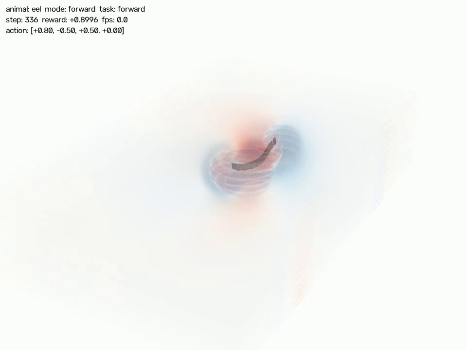
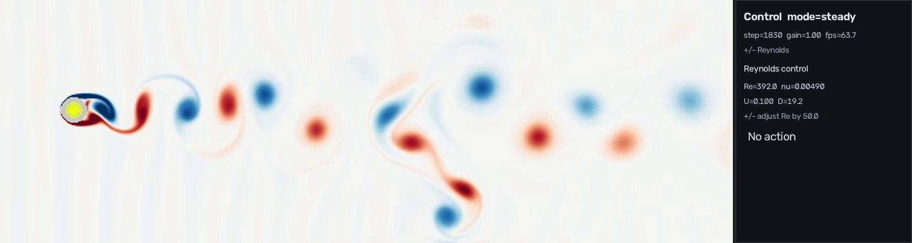

# LBM-RIGID


[](LICENSE)

LBM-RIGID is a GPU-oriented research simulator for coupling lattice-Boltzmann
fluid dynamics with three-dimensional MuJoCo-Warp rigid bodies. It supports a
projected D2Q9 workflow for fast 2D experiments, a mesh-coupled D3Q27 solver for
3D flow, realtime visualization, and reinforcement-learning control.

## Demo gallery

| Projected 2D eel | 3D eel vorticity slices |
| :---: | :---: |
| [](outputs/eel_lbm.mp4) | [](outputs/eel_lbm_orbit_slice9.mp4) |
| [Open MP4](outputs/eel_lbm.mp4) | [Open MP4](outputs/eel_lbm_orbit_slice9.mp4) |

| 2D Kármán vortex street | SAC forward policy |
| :---: | :---: |
| [](outputs/karman_vortex_2d.mp4) | [](outputs/sac_minimal/videos/eel2d_forward_policy.mp4) |
| [Open MP4](outputs/karman_vortex_2d.mp4) | [Open MP4](outputs/sac_minimal/videos/eel2d_forward_policy.mp4) |

## Features

- **Projected 2D coupling:** D2Q9 HOME-LBM boundaries derived from full 3D
  MuJoCo body geometry and motion.
- **Mesh-coupled 3D flow:** D3Q27 simulation around articulated or static
  immersed meshes.
- **GPU rigid-body dynamics:** MuJoCo-Warp integration with batched worlds for
  control and learning experiments.
- **Realtime tools:** 2D field views, orbiting 3D vorticity slices, keyboard
  presets, recording, and live Reynolds-number control for Kármán scenes.
- **Reinforcement learning:** Stable-Baselines3 SAC training with four-parameter
  planar eel CPG control.

## Prerequisites

- Python 3.11; a Conda environment is recommended.
- An NVIDIA CUDA-capable GPU for the simulation runtime.
- A CUDA-compatible PyTorch installation.
- The dependencies listed in [`requirements.txt`](requirements.txt).

The commands below use PowerShell syntax and assume the repository root as the
working directory.

## Installation

```powershell
conda create -n dreamer python=3.11 -y
conda activate dreamer

pip install torch --index-url https://download.pytorch.org/whl/cu128
pip install mujoco-warp
pip install -r requirements.txt
```

## Quick start

### Realtime projected 2D eel

```powershell
python tools/lbm2d_realtime_control.py `
  --config configs/realtime_2d/eel2d.json
```

The MuJoCo rigid bodies remain three-dimensional; only their immersed boundary
is projected into the planar LBM field. Use `W/A/S/D/F` to switch the checked-in
motion presets, `Space` to pause, `R` to reset, and `Q` or `Esc` to quit.

### Realtime 2D Kármán flow

```powershell
python tools/lbm2d_realtime_control.py `
  --config configs/realtime_2d/karman2d.json
```

The fixed 3D MuJoCo cylinder is projected into the D2Q9 domain. Press `+` or `-`
to adjust the Reynolds number while the simulation is running.

### Realtime 3D eel

```powershell
python tools/lbm3d_realtime_control.py `
  --config configs/realtime_3d/eel3d.json `
  --preset forward `
  --view-mode orbit
```

Orbit mode renders transparent signed-vorticity slices around the articulated
3D eel. Drag to rotate the camera and use the mouse wheel to zoom.

### SAC forward training

```powershell
python train_sac_minimal.py `
  --animal eel `
  --control-mode cpg `
  --task forward `
  --per-frame-steps 8 `
  --cpg-ramp-steps 10 `
  --cpg-hold-steps 30 `
  --episode-steps 100 `
  --warmup-exploration rand `
  --learning-starts 250 `
  --warmup-steps 15 `
  --checkpoint-every 1000 `
  --total-steps 10000
```

This command trains the eel on the forward task. Add `--render` for a short
visual check.

## Checked-in configurations

| Configuration | Scenario |
| --- | --- |
| [`configs/realtime_2d/eel2d.json`](configs/realtime_2d/eel2d.json) | Projected articulated eel in D2Q9 flow |
| [`configs/realtime_2d/karman2d.json`](configs/realtime_2d/karman2d.json) | Projected cylinder and 2D Kármán wake |
| [`configs/realtime_3d/eel3d.json`](configs/realtime_3d/eel3d.json) | Articulated eel with 3D vorticity rendering |
| [`configs/realtime_3d/karman3d.json`](configs/realtime_3d/karman3d.json) | Static cylinder in a D3Q27 domain |

The JSON files define model paths, lattice resolution, coupling substeps, flow
parameters, rendering options, and realtime controls.

## Python API

The supported high-level imports include:

```python
from envs.lbm import Eel2DLBMEnv, HomeFlow, Karman2DEnv, LBMFluidEnv, LBM_Solver
from envs.lbm3d import Eel3DLBMEnv, HomeFlow3D, Karman3DEnv, LBMFluidEnv3D, LBM_Solver3D
```

See the [API reference](docs/api/index.md) for solver, flow-state, and environment
contracts.

## Documentation

| Guide | Purpose |
| --- | --- |
| [Getting started](docs/getting-started.md) | Installation and first run |
| [Architecture](docs/architecture.md) | LBM/MuJoCo coupling loop |
| [Realtime 2D](docs/examples/realtime-2d.md) | Projected bodies and Kármán controls |
| [Realtime 3D](docs/examples/realtime-3d.md) | Orbit view and vorticity export |
| [SAC training](docs/examples/sac-training.md) | Train, load, and export the forward policy |
| [API reference](docs/api/index.md) | Public Python objects |

Build the documentation locally with:

```powershell
pip install -r requirements-docs.txt
mkdocs build --strict
```

For a live local site, run `mkdocs serve` and open
`http://127.0.0.1:8000/`.

## Repository layout

```text
configs/              Realtime 2D and 3D JSON scenes
docs/                 MkDocs guides, API reference, and screenshots
envs/lbm/             D2Q9 solver and projected-rigid environments
envs/lbm3d/           D3Q27 solver and mesh-coupled environments
outputs/              Checked-in demo videos and pretrained SAC policy
tools/                Realtime, export, and documentation utilities
train_sac_minimal.py  Minimal SAC training/evaluation entry point
```

## License

LBM-RIGID is distributed under the
[GNU General Public License v3.0 or later](LICENSE) (`GPL-3.0-or-later`).
