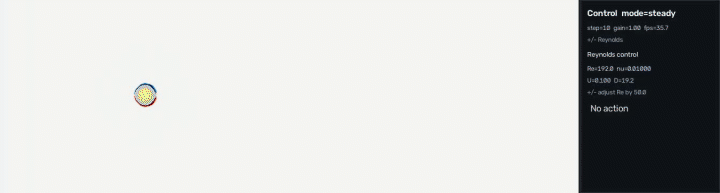
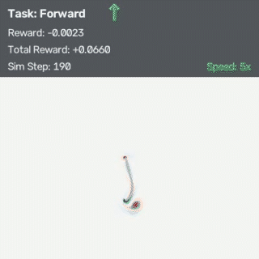

# Open HOME-LBM


[](https://kuiwuchn.github.io/OpenHOMELBM/)
[](LICENSE)

Open HOME-LBM is an open-source research codebase based on the High-Order
Moment-Encoded Lattice Boltzmann Method (HOME-LBM) introduced by Li et al.
(2023). It extends the original implementation with MuJoCo-Warp coupled
environments and realtime demonstrations. It also provides Python scripts for
training and evaluating SAC controllers for articulated swimmers.

The numerical method and base implementation come from
[High-Order Moment-Encoded Kinetic Simulation of Turbulent Flows](https://kuiwuchn.github.io/homelbm.html).

## Demo gallery

### 2D Kármán wake



### SAC forward task

<p align="center">
  
</p>

## Features

- **HOME-LBM foundation:** Moment-encoded D2Q9 and D3Q27 fluid solvers running
  on Warp.
- **Projected 2D coupling:** D2Q9 boundaries derived from full 3D
  MuJoCo body geometry and motion.
- **Mesh-coupled 3D flow:** D3Q27 simulation around articulated or static
  immersed meshes.
- **GPU rigid-body dynamics:** MuJoCo-Warp integration with batched worlds for
  control and learning experiments.
- **Realtime tools:** 2D field views, orbiting 3D vorticity slices, keyboard
  presets, recording, and live Reynolds-number control for Kármán scenes.
- **Reinforcement learning:** Stable-Baselines3 SAC training with four-parameter
  planar eel CPG control.

## Prerequisites

- Python 3.11; a Conda environment is recommended.
- An NVIDIA CUDA-capable GPU for the simulation runtime.
- A CUDA-compatible PyTorch installation.
- The dependencies listed in [`requirements.txt`](requirements.txt).

The commands below use PowerShell syntax and assume the repository root as the
working directory.

## Installation

```powershell
conda create -n dreamer python=3.11 -y
conda activate dreamer

pip install torch --index-url https://download.pytorch.org/whl/cu128
pip install mujoco-warp
pip install -e .
```

The included `setup.py` defines the project metadata, discovers the Python
packages under `envs`, reads runtime dependencies from `requirements.txt`, and
includes the MuJoCo XML assets. The `pip install -e .` command uses this
configuration for an editable installation, so changes in the checkout are
available without reinstalling the package.

## Quick start

### Realtime projected 2D eel

```powershell
python tools/lbm2d_realtime_control.py `
  --config configs/realtime_2d/eel2d.json
```

The MuJoCo rigid bodies remain three-dimensional; only their immersed boundary
is projected into the planar LBM field. Use `W/A/S/D/F` to switch the checked-in
motion presets, `Space` to pause, `R` to reset, and `Q` or `Esc` to quit.

### Realtime 2D Kármán flow

```powershell
python tools/lbm2d_realtime_control.py `
  --config configs/realtime_2d/karman2d.json
```

The fixed 3D MuJoCo cylinder is projected into the D2Q9 domain. Press `+` or `-`
to adjust the Reynolds number while the simulation is running.

### Realtime 3D eel

```powershell
python tools/lbm3d_realtime_control.py `
  --config configs/realtime_3d/eel3d.json `
  --preset forward `
  --view-mode orbit
```

Orbit mode renders transparent signed-vorticity slices around the articulated
3D eel. Drag to rotate the camera and use the mouse wheel to zoom.

### SAC forward training

```powershell
python train_sac_minimal.py `
  --animal eel `
  --control-mode cpg `
  --task forward `
  --per-frame-steps 8 `
  --cpg-ramp-steps 10 `
  --cpg-hold-steps 30 `
  --episode-steps 100 `
  --warmup-exploration rand `
  --learning-starts 250 `
  --warmup-steps 15 `
  --checkpoint-every 1000 `
  --total-steps 10000
```

This command trains the eel on the forward task. Add `--render` for a short
visual check.

## Python API

The supported high-level imports include:

```python
from envs.lbm import Eel2DLBMEnv, HomeFlow, Karman2DEnv, LBMFluidEnv, LBM_Solver
from envs.lbm3d import Eel3DLBMEnv, HomeFlow3D, Karman3DEnv, LBMFluidEnv3D, LBM_Solver3D
```

See the [API reference](docs/api/index.md) for solver, flow-state, and environment
contracts.

## Documentation

Read the published documentation at
[Open HOME-LBM documentation](https://kuiwuchn.github.io/OpenHOMELBM/).

| Guide | Purpose |
| --- | --- |
| [Getting started](docs/getting-started.md) | Installation and first run |
| [Architecture](docs/architecture.md) | LBM/MuJoCo coupling loop |
| [Realtime 2D](docs/examples/realtime-2d.md) | Projected bodies and Kármán controls |
| [Realtime 3D](docs/examples/realtime-3d.md) | Orbit view and vorticity export |
| [SAC training](docs/examples/sac-training.md) | Train, load, and export the forward policy |
| [API reference](docs/api/index.md) | Public Python objects |

## Repository layout

```text
configs/              Realtime 2D and 3D JSON scenes
docs/                 MkDocs guides, API reference, and screenshots
envs/lbm/             D2Q9 solver and projected-rigid environments
envs/lbm3d/           D3Q27 solver and mesh-coupled environments
outputs/              Checked-in demo videos and pretrained SAC policy
tools/                Realtime, export, and documentation utilities
train_sac_minimal.py  Minimal SAC training/evaluation entry point
```

## License

Open HOME-LBM is distributed under the
[GNU General Public License v3.0 or later](LICENSE) (`GPL-3.0-or-later`).

## Citation

The numerical foundation and base implementation of Open HOME-LBM come from the
HOME-LBM paper:

> Wei Li, Tongtong Wang, Zherong Pan, Xifeng Gao, Kui Wu, and Mathieu Desbrun.
> "High-Order Moment-Encoded Kinetic Simulation of Turbulent Flows."
> *ACM Transactions on Graphics*, 42(6), Article 190, 2023.
> [HOME-LBM project page](https://kuiwuchn.github.io/homelbm.html) |
> [DOI: 10.1145/3618341](https://doi.org/10.1145/3618341)

```bibtex
@article{li2023home,
  author  = {Li, Wei and Wang, Tongtong and Pan, Zherong and Gao, Xifeng and Wu, Kui and Desbrun, Mathieu},
  title   = {High-Order Moment-Encoded Kinetic Simulation of Turbulent Flows},
  journal = {ACM Transactions on Graphics},
  volume  = {42},
  number  = {6},
  articleno = {190},
  year    = {2023},
  doi     = {10.1145/3618341}
}
```
