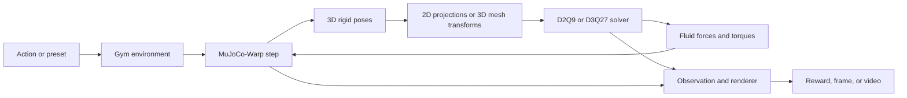

# Architecture

Open HOME-LBM keeps the HOME-LBM fluid solver, rigid-body engine, task
environment, and visualization layers separate enough to reuse the same
numerical core across interactive demos and reinforcement-learning
environments.

The D2Q9 and D3Q27 numerical core is based on the HOME-LBM method introduced in
[Li et al. (2023)](https://kuiwuchn.github.io/homelbm.html). This page focuses on how
that solver is organized with MuJoCo-Warp coupling, environments, rendering,
and training in this repository.

## Layers

### Flow state

`HomeFlow` and `HomeFlow3D` are Warp structs containing the fluid fields,
boundary data, solid transforms, and force buffers for one world. Two-dimensional
arrays use `(nx, ny)` storage; three-dimensional arrays use `(nx, ny, nz)`.

### Solver

`LBM_Solver` and `LBM_Solver3D` own one flow struct per parallel world. Their
first `step()` captures the LBM kernels in a Warp graph; subsequent calls replay
the captured graph.

### Coupled environment

`LBMFluidEnv` and `LBMFluidEnv3D` coordinate 3D MuJoCo-Warp dynamics and the
fluid solver. In `LBMFluidEnv`, 3D body geometry and motion are projected onto
the 2D LBM plane before each coupling update. `LBMFluidEnv3D` instead transfers
the 3D mesh transforms directly. Environment subclasses define observations,
rewards, termination conditions, and task-specific action meanings.

### Configuration and demos

The realtime entry points under `tools/` translate JSON configurations into
environments, keyboard presets, rendering options, and optional video exports.
The training entry point wraps a configured 2D environment for Stable-Baselines3
SAC.

## Coordinates and data layout

- MuJoCo rigid-body dynamics are always three-dimensional.
- LBM grid positions are expressed in lattice-cell coordinates.
- Two-dimensional fields are stored in `(nx, ny)` order and transposed for
  image display.
- The 2D coupling path represents each 3D body by a projected planar polygon;
  it does not replace MuJoCo with a 2D rigid-body solver.
- Three-dimensional fields are stored in `(nx, ny, nz)` order.
- MuJoCo mesh vertices remain in body-local coordinates so their origin stays
  aligned with the body or joint pivot.
- Quaternions passed through the 3D public solver API use `(w, x, y, z)` order.

Environment-specific configuration may introduce additional action and target
conventions. Consult the matching JSON file and demo page before interpreting
an observation or action vector.
